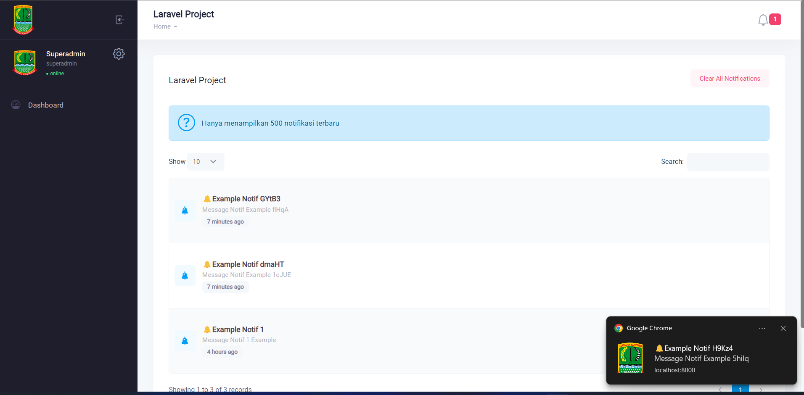

# This example using FCM  

## How to use

* composer update
* php artisan migrate --seed
* copy **.env** to your project
* setup **FCM_SERVER_KEY, RECAPTCHA_SITE_KEY, and RECAPTCHA_SECRET_KEY**  on your env
* php artisan serve --port=8000

## How to Demo

* allow your browser to get notification
* default account username **superadmin** with password **123123123**
* running **php artisan command:create_notif** to create notif
* running **php artisan command:send_notif** to send  notif

